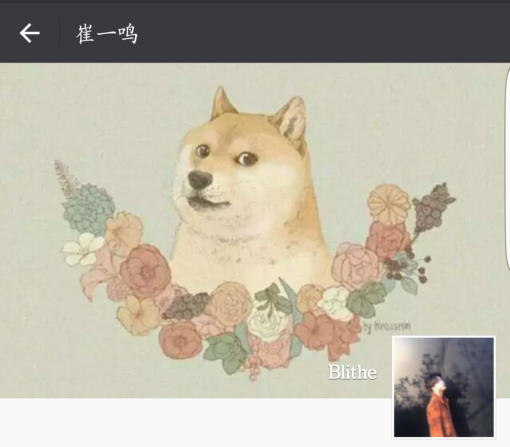
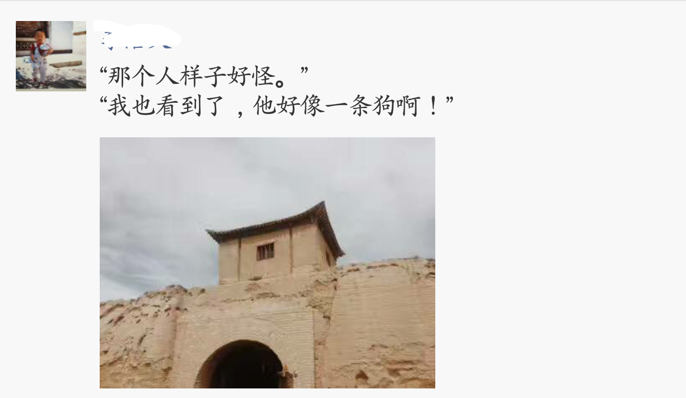
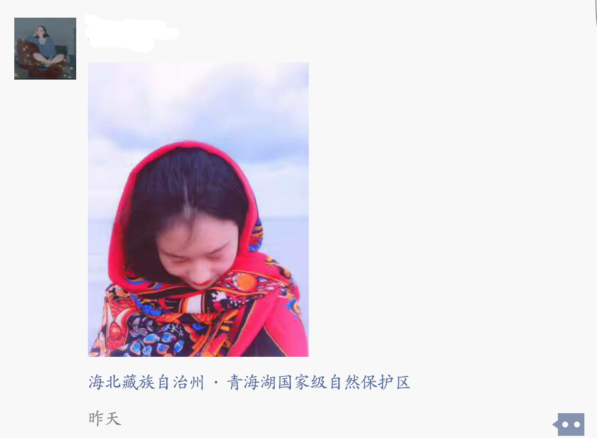

## iOS 组考核

### 题目一： UITableView 的考察
- 高仿朋友圈的页面，具体要求如下：
    - 奇偶数显示不同的 cell 的样式，每种样式的 cell 的个数不得少于 5 个
    - cell 中的内容可以随意发挥，但是不可重复
    - cell 的样式如下所示，可自由发挥
    

### 题目二：UITextField 的考察

- 实现 share 的登陆注册界面，具体要求如下：
	- 设置占位提醒字
	- 能够实现键盘回收
	- 实现登陆逻辑，当输入的 username == 04151001 && password == 1234567890 时，跳转到主界面（主界面为考核内容三）
	- 实现注册逻辑，当我输入内容后，点击注册按钮时，由注册页面跳转回登陆界面，并且传回注册界面 username 的字符串
	
### 题目三：UINavagationController 和 UITabBarController 的考察
- 实现类似 share 的主页面，包含底部的 tabBar 和 顶部的 navgationBar
- 包含 界面的 push 和 pop 
- 自定义你的 leftBarItem, 样式如第一个图的 navagationBar

### 题目四：UIButton 的考察
- 在 TabBarController 中任何一个控制器里实现对于多个 button 的选中效果，类似于 share 的第二个界面
- 至少要求有 五个 button 

## 注意：
三个考核内容可以合并为一个项目，并且最后上传到你的 GitHub 上

